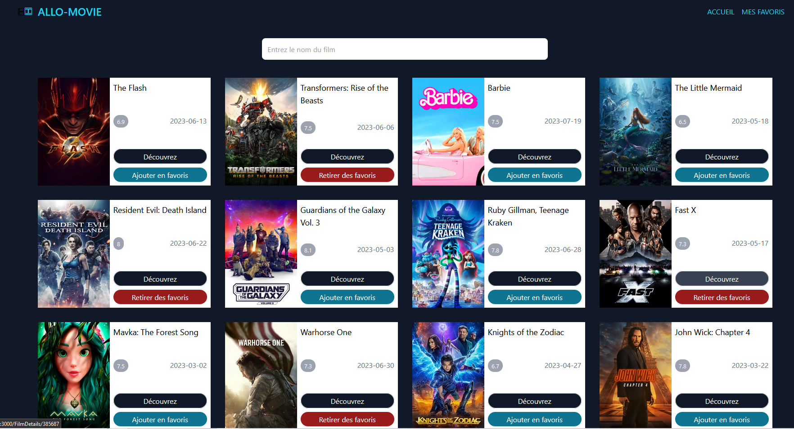
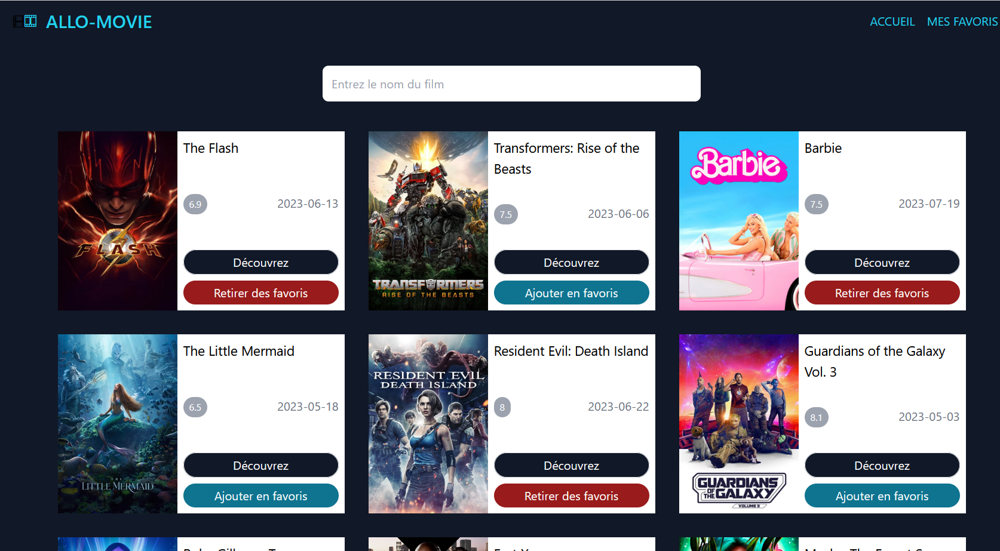
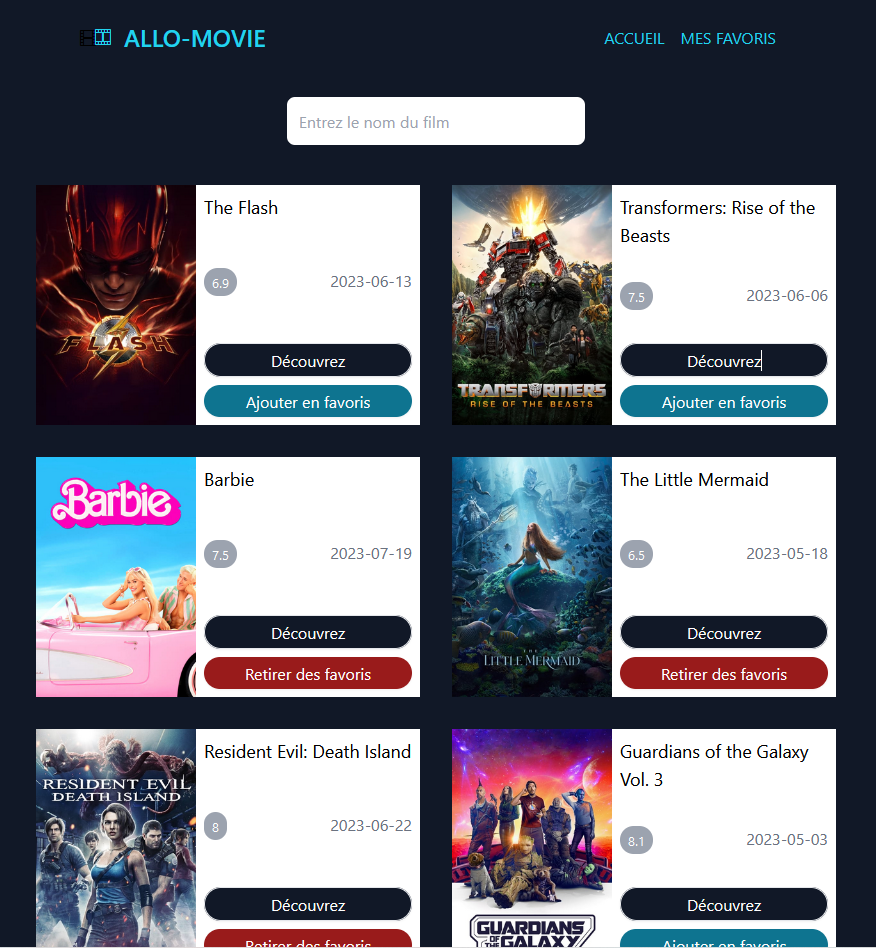
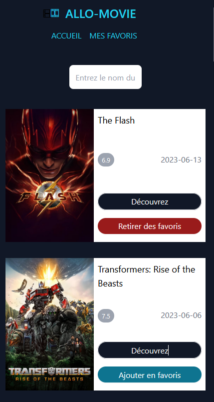
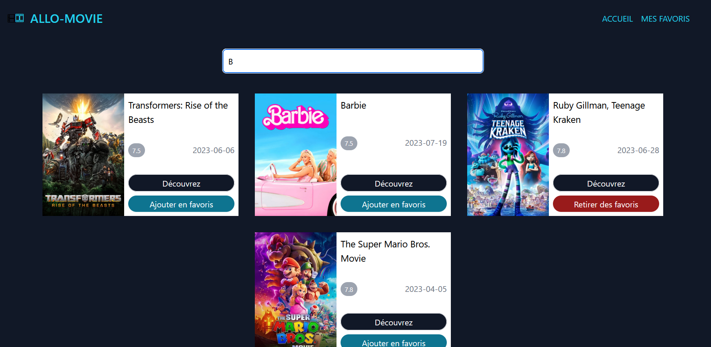
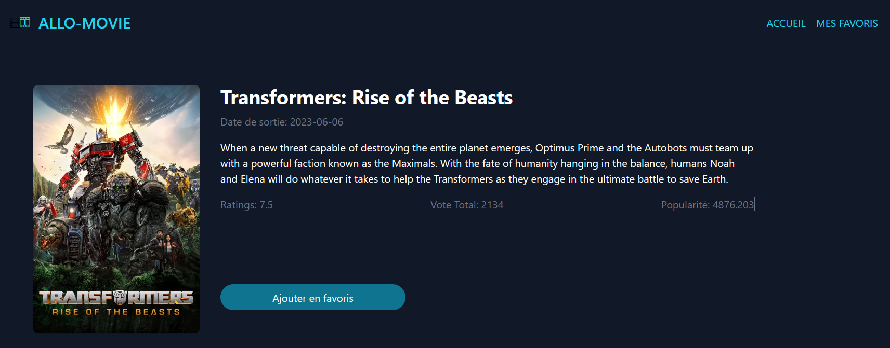
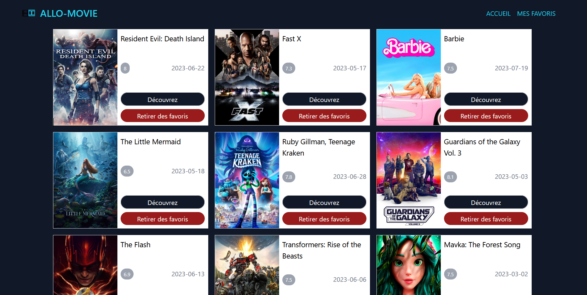

# Projet Ecommerce : ALLO-MOVIE (REACT)
Application à la Allociné.
Il s’agit de créer une application web responsive de découverte et recherche de films, avec
laquelle on pourra enregistrer des films en favoris

# Outils utilisée (Frontend):
Tailwind-CSS, React, Yarn

## Caractéristique :
Les films seront récupérés via l’API : themoviedb (
https://www.themoviedb.org/?language=fr ). Api gratuite, qui nécessite de se
créer un compte pour récupérer un token de connexion (JWT).
Les favoris ne seront pas enregistrés via l’API, mais pourront être enregistrés dans
le local Storage 

## Besoin :
Page d’accueil : films à découvrir
1. On doit pouvoir voir de petite carte Film avec les informations
principal des films, et deux boutons :
2. Add / Remove : pour ajouter ou enlever le film des favoris
- Details : pour rediriger vers la page de détails du film
  Minimum 20
- Optionnel : pagination pour afficher 20 films à la fois (les 20 premiers,
puis 20 suivants, etc…)
3. Page détails : permettant de voir les détails d’un film, avec également la
gestion de favoris dans cette page.
4. Page Favoris : permettant de voir la liste des films enregistrés en favoris
5. Dans toutes les pages on doit avoir :
6.  NavBar : permettant de naviguer vers l’accueil et les favoris
7. Champs de recherche : permettant de rechercher des films via l’API
themoviedb

## Screenshots

